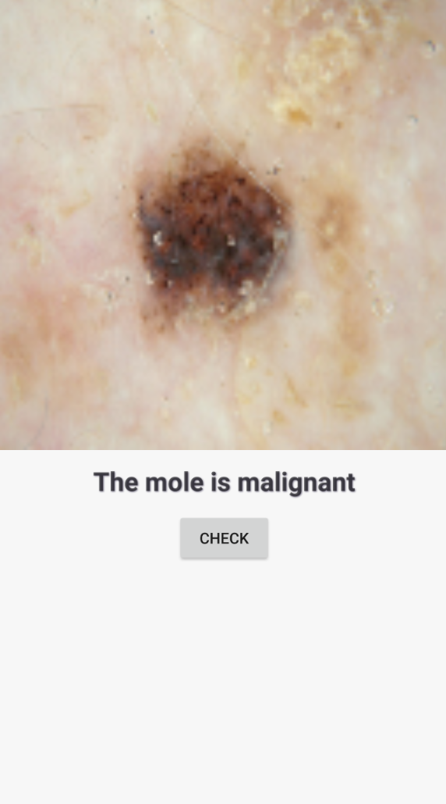

# Skin Cancer Classification Android App

This demo demonstrates MIRF usage on Android. This is a toy example that uses MIRF to classify skin image from phone memory and indicate whether the case of skin cancer may be present on the image. 

This main purpose of this demo is to show that MIRF may be used not only on desktop but on the Android device.

