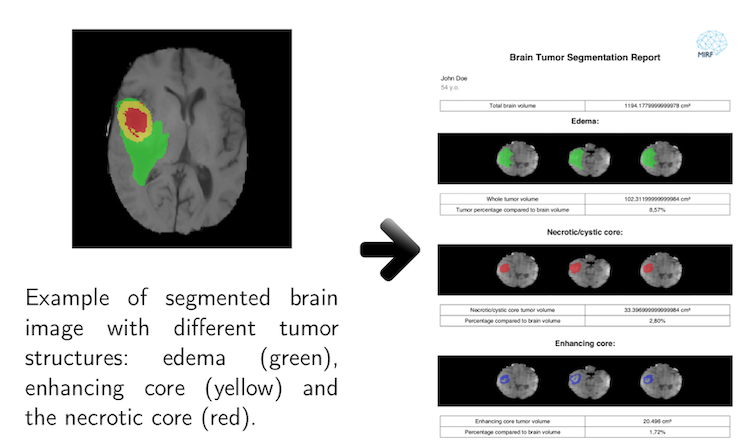

# Brain Tumor Segmentation Demo

This demo demonstrates usage of MIRF framework by creating a pipeline for MRI brain scans analysis and consecutive report generation from the obtained data. This example is neither a complete medical tool nor intended to be such. MirfBrainTumor serves solely as an example of MIRF pipeline facilitation and a potential use case for the platform.

MirfBrainTumor performs the brain tumor segmentation and indicates 3 different tumor structures. The medical report with the images and volume calculations is generated afterwards.
## Set up Demo
Before executing the MIRF code, run the following commands in your terminal:
```
cd PATH_TO_THIS_FOLDER/segmentation
python3 setup.py
```
It will prepare the necessary dependencies for the segmentation algorithm. 

## Running the Demo

### Input Data
User should provide a folder that contains brain images with 4 MRI modalities: T1, T2, T1ce, Flair. Also the base image of the brain on which all the masks would be applied in the report should be selected. The app was tested with the data from the BRATS challenge. 

User should also provide an output directory, where the report will be saved.

Because it is only an example the data format is strict. For the actual deployment of the following pipeline, the segmentation algorithm should be altered and optimized to use different number of modalities. Potentially, new data should be provided to train the segmentation algorithm. 

The patients name and age are optional and may be provided in the corresponding fields to be included in the final report.

## Execution
After providing all the necessary data, press generate. The execution may take a while, especially if you don’t have a gpu, that may be used for running neural networks. Single image processing may take up to 20 minutes on CPU. 

When the report will be finished, it will automatically appear in the corresponding view of the app.

## Output Data
Both the segmentation masks and the final report are saved automatically by MIRF. The segmentation masks may be found at segmentation/result folder. The segmentation masks may be opened in a separate app for viewing medical segmentations (such as ITK-SNAP). This will probably change in the future versions of MIRF, when the core gui elements will be added.

The report will be saved in the directory, specified by User.